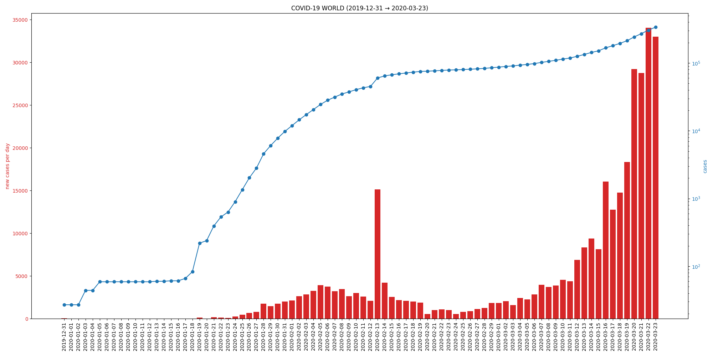
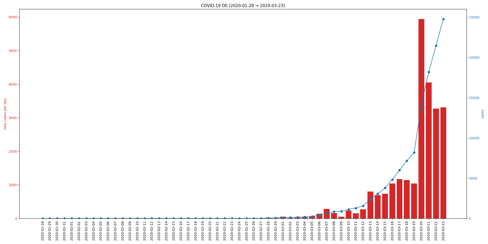

# COVID-19-GeoPlot

A tool to visualize up-to-date case data published by the [ECDC](https://www.ecdc.europa.eu).

Please note that daily numbers only include yesterday (today's cases will appear tomorrow) and request may not work until current data is uploaded.

### Usage

``` 
usage: covid.py [-h] [-c <str>] [-C <list<str>>] [-s] [-L] [-l]

optional arguments:
  -h, --help            show this help message and exit
  -c <str>, --column <str>
                        one of ['cases', 'deaths']
  -C <list<str>>, --country <list<str>>
                        comma separated list of GeoIDs (e.g. "DE,US")
  -s, --show            show plot instead of saving
  -L, --list            list available GeoIDs
  -l, --log             logarithmic scale
```

### Examples

Logarithmic plot of cases from all regions:



Linear plot of cases from Germany:


